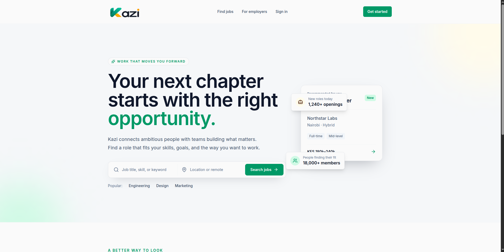

# Adams Kiptalam

### Full Stack Software Developer

**React · Next.js · Node.js · NestJS · PostgreSQL · MongoDB · Prisma**

Building production-ready web applications with modern frontend and backend technologies.

  <a href="https://adams-kiptalam.vercel.app" target="_blank">Portfolio</a>
  ·
  <a href="https://www.linkedin.com/in/adams-kiptalam/" target="_blank">LinkedIn</a>
  ·
  <a href="mailto:adamskiptalam0@gmail.com" target="_blank">Email</a>
  ·
  <a href="./assets/Adams_Kiptalam_Resume.pdf" target="_blank">Resume</a>

---

## About Me

I'm a Full Stack Software Developer focused on building practical, scalable web applications.

I work with **authentication and authorization, RBAC, REST APIs, relational database design, multi-tenant systems, real-time features, and full-stack application architecture**.

Currently open to **full-time and freelance opportunities**.

## Featured Project

### Kazi — Job Marketplace

**Kazi** is a full-stack job marketplace connecting candidates with employers. It supports job discovery, applications, employer management, authentication, company roles, and notifications.

### Engineering Highlights

- Secure authentication using access and refresh tokens
- HTTP-only authentication cookies
- Role-based access control
- Candidate and employer workflows
- Company membership and role management
- Job creation and management
- Job application lifecycle
- Notification system
- RESTful API architecture
- PostgreSQL database with Prisma ORM
- Responsive Next.js frontend

### Tech Stack

**Frontend:** Next.js · React · TypeScript · Tailwind CSS · TanStack Query

**Backend:** NestJS · TypeScript · REST API

**Database:** PostgreSQL · Prisma

**Infrastructure:** Vercel · Render · Neon · GitHub

  <a href="https://kazi-six-blue.vercel.app">Live Demo</a>
  ·
  <a href="https://github.com/kiptalam1/Kazi">GitHub Repository</a>

---

## Other Projects

### ProjoStack

**Multi-tenant workspace management platform** for managing organizations, projects, tasks, and team members.

**Key features:** Multi-tenancy · RBAC · Workspace invitations · Task assignments · Project management · JWT authentication

**Stack:** React · TypeScript · Node.js · Express · PostgreSQL · Prisma · Tailwind CSS

<a href="https://projostack.onrender.com">Live Demo</a> ·
<a href="https://github.com/kiptalam1/projostack">Repository</a>

### Housekonekt

**Property listing and tenant-landlord communication platform** that allows landlords to publish properties and tenants to discover, filter, and communicate about available housing.

**Key features:** Property listings · Search & filtering · Image uploads · Real-time chat · Tenant-landlord communication

**Stack:** React · Node.js · Express · PostgreSQL · Socket.IO · Tailwind CSS

<a href="https://housekonekt.onrender.com">Live Demo</a> ·
<a href="https://github.com/kiptalam1/housekonekt">Repository</a>

### Malibaze

**Full-stack e-commerce platform** with product management, shopping cart functionality, authentication, order management, and payment processing.

**Key features:** Product catalog · Shopping cart · Authentication · Orders · Payment integration

**Stack:** React · Node.js · Express · MongoDB · JWT · CSS Modules

<a href="https://malibazee.onrender.com">Live Demo</a> ·
<a href="https://github.com/kiptalam1/malibaze">Repository</a>

## Technical Stack

### Frontend

  
  &nbsp;
  
  &nbsp;
  
  &nbsp;
  
  &nbsp;
  
  &nbsp;
  
  &nbsp;
  

### Backend & Data

  
  &nbsp;
  
  &nbsp;
  
  &nbsp;
  
  &nbsp;
  
  &nbsp;
  

**ORM & Data Access:** Prisma

### Engineering Focus

Authentication · Authorization · RBAC · REST APIs · Database Design · Multi-tenancy · Real-time Applications · API Integration

### Tools

  
  &nbsp;
  
  &nbsp;
  
  &nbsp;
  
  &nbsp;
  
  &nbsp;
  
  &nbsp;
  
  &nbsp;
  

### Other Skills

  
  &nbsp;
  
  &nbsp;
  
  &nbsp;
  
  &nbsp;
  

## GitHub Activity

<table align="center">
  <tr>
    <td>
      
    </td>
    <td>
      
    </td>
  </tr>
</table>

---

## Let's Connect

I'm open to opportunities where I can contribute to building useful, reliable software.

  
  &nbsp;&nbsp;&nbsp;
  
  &nbsp;&nbsp;&nbsp;
  
  &nbsp;&nbsp;&nbsp;
  

